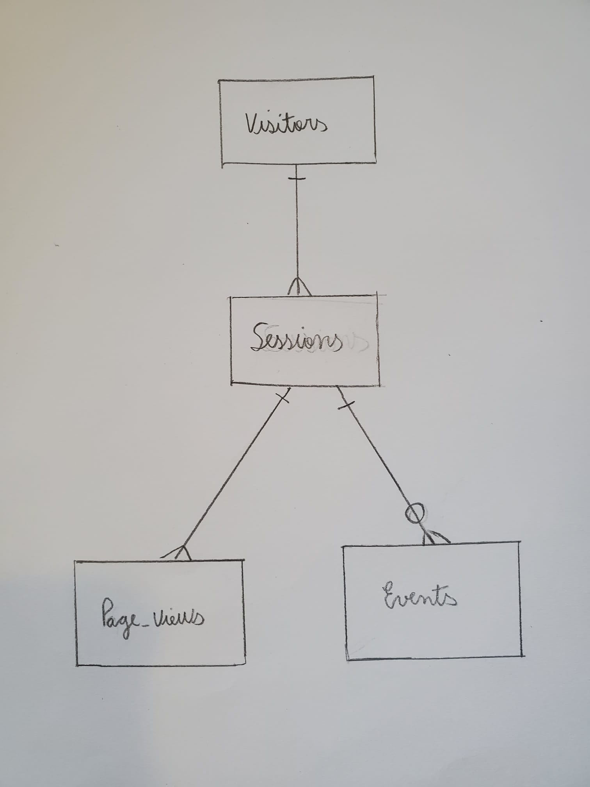

# Design Document

By Sara Costa Cabral Mululo

Video overview: <https://youtu.be/r1Y_lTCtQZ0>

Project name: Website Traffic Analysis Database

## Scope

The purpose of my database is to store and analyze website traffic data. Websites often collect information about their visitors, such as the pages they visited, and the actions they take while browsing. This kind of data helps website owners understand which pages are most popular, how users navigate their site, and which actions are most commonly performed. I designed this database to store this type of activity and to help analyze user behavior.

The main things included in the scope of my database are the visitors themselves, the sessions they create while browsing the website, the pages they view during those sessions, and the events they trigger, such as clicking a button or scrolling a page. Visitors are represented with unique IDs, the type of device and browser they are using to connect to the website, and their location (city/country). Visitors can have sessions, in which it is possible to track specific browsing activities, such as start and end times, landing pages, and referrers. Page views track each page a user visits along with how much time they spend on it. Events represent specific actions users take during a session, like clicking on a signup button or hovering over a link.

Things that are outside the scope of this database are visitors' personal information beyond city and country, website content details such as the actual text or images on pages, and external analytics like advertising conversions or social media interactions. This database does not track user login credentials, payment information, or other sensitive user data. It is also limited to tracking individual user activity on a single website.

## Functional Requirements

Users of this database should be able to gather information about the website activity and understand their visitor's behavior. For example, a user should be able to:

- Identify the most visited pages and the pages with the highest average time spent.
- Analyze how many sessions each visitor has, how many pages they viewed, and how long they spent browsing.
- Summarize events by type, such as clicks, scrolls, and signups, to see which actions are most common.
- Examine trends, such as daily traffic and session counts.
- Insert, update, or delete visitor, session, page view, or event records.

Features beyond the scope of what a user should be able to do with my database are making complex predictions, showing live updating data, or integrating with other websites. This database was built using SQLite therefore is also not designed for large-scale production-level data, though it can be scaled to a certain extent with indexes and views.

## Representation

### Entities

The entities I chose to represent in my database are: **visitors**, **sessions**, **page views**, and **events**.
The entities attributes are as follows:

1. **Visitors**
Each visitor is represented with an ID, device type, browser, city, and country. The ID is a unique primary key. The device type is restricted to common categories like desktop, mobile, tablet, TV, or console to ensure consistent data entry. City and country are required fields to allow basic demographic analysis. Browser is optional (since not all visitors are trackable) but helps understand user experience differences across software. I gave it a DEFAULT value 'unknown' to avoid having NULL values in the COUNT/GROUP BY queries.

2. **Sessions**
Each session represents a period of activity by a visitor. A session has an ID, a foreign key linking it to the visitor, start and end times, the referrer URL, and the landing page. Start time is required, while end time can be null if a session is still ongoing. The landing page is required because it is essential for analyzing initial user engagement. The foreign key ensures that each session is associated with a valid visitor. I included DELETE ON CASCADE in all foreign keys so that deletion of a visitor ID, or session ID, is possible.

3. **Page Views**
Each page view is linked to a session and contains information about the page URL, timestamp, and the time spent on that page. The foreign key ensures page views belong to a valid session. This entity allows analysis of which pages are most popular and how long users interact with them.

4. **Events**
Events track specific actions within a session, such as clicks, scrolls, hovers, and signups. Each event includes a foreign key to its session, the event type, the event target (like a button or form), and a timestamp. A CHECK constraint is used to limit event types to a predefined set, ensuring data consistency.

All entities have been designed with appropriate data types and constraints to prevent invalid data entry and maintain database integrity.

### Relationships

The relationships between entities in my database are as follows:
- One visitor can have **many sessions**, but each session belongs to **one visitor**.
- One session can have **many page views** and **many events**, but each page view and event belongs to **one session**.
- Some sessions may not have events, so the relationship is optional from the event side.

Here is a picture of my entity relationship diagram for this database (made with pen and paper):

Using the Crow’s Foot notation, the relationships can be described as:
[Visitors] —< [Sessions] —< [Page_Views]
                    o<[Events]

This diagram shows that each visitor may have multiple sessions, each session may have multiple page views, and each session may have zero or more events.

## Optimizations

To improve query performance, several **indexes** and **views** were created. Indexes include visitor IDs in sessions, session IDs in page views and events, and columns that are frequently filtered or grouped such as landing pages, countries, and device types. These indexes make queries faster when analyzing the most visited pages, most active visitors, or top landing pages.

Views are used to simplify commonly used queries. For example, `top_pages` summarizes the most visited pages, `visitor_sessions` summarizes visitor activity, `event_summary` aggregates event counts by type, `daily_traffic` tracks traffic trends, and `top_landing_pages` identifies the most common entry points to the website. These views allow users to quickly access key metrics without having to rewrite complex SQL queries.

## Limitations

My database has several limitations. First of all, it is **limited to a single website** and cannot easily analyze multiple websites at once. Second, it does not track users' personal information beyond general demographics, so it cannot provide personalized analytics. Third, the database is not designed for **real-time analytics** or extremely high traffic volumes, as it focuses on query optimization on a moderate scale. The database also contains predefined event types and device categories. Any new type of event or device would require updating the schema to accommodate them.

In summary, the database is a simplified but realistic representation of web analytics data. I strived to  demonstrate my SQL design, querying, indexing, and view creation skills that I gained during the CS50SQL course. Moreover, I tried to show how entities, relationships, and constraints can be structured in a practical database project.
